# Class Diagram of sec-scraper

The class diagram below shows the relationship between the classes in the sec-scraper package. The `SECData` class is responsible for fetching data from the SEC website. The `TickerData` class is responsible for fetching data related to a specific ticker. The `Scraper` class is responsible for performing scraping operations scraping data from the SEC website. The `Storer` class is responsible for storing data in the database (MongoDB). The `SearchStrategy` class is an interface that defines the search strategy for the `Scraper` class. The `ContextSearchStrategy`, `LinkLabelSearchStrategy`, and `FactSearchStrategy` classes are concrete implementations of the `SearchStrategy` interface.

```mermaid
classDiagram
    class SECData {
      -BASE_API_URL: str
      -BASE_SEC_URL: str
      -BASE_DIRECTORY_URL: str
      -SIC_LIST_URL: str
      -US_GAAP_TAXONOMY_URL: str
      -SRT_TAXONOMY_URL: str
      -ALLOWED_TAXONOMIES: set
      -INDEX_EXTENSIONS: set
      -DIRECTORY_INDEX: set
      -FILE_EXTENSIONS: set
      -SCRAPE_FILE_EXTENSIONS: set
      -_requester: RateLimitedRequester
      -sec_headers: dict
      -sec_data_headers: dict
      -_cik_list: dict
      +cik_list: DataFrame
      -_us_gaap_tags: list
      +us_gaap_tags: list
      -_srt_tags: list
      +srt_tags: list
      +taxonomy: str
      +__init__(requester_company: str, requester_name: str, requester_email: str, taxonomy: str = "us-gaap"): None
      +get_cik_list(): pd.DataFrame
      +get_ticker_cik(ticker: str): str
      +get_tags(): pd.DataFrame
      +get_submissions(cik: str, submission_file: str): dict
      +get_company_concept(cik: str, tag: str, taxonomy: str): dict
      +get_company_facts(cik: str): dict
      +get_frames(taxonomy: str, tag: str, unit: str, period: str): dict
      +get_data_as_dataframe(cik: str): pd.DataFrame
      +get_cik_index(cik: str): dict
      +get_sic_list(sic_list_url: str): dict
    }

    class TickerData {
      -scrape_logger: MyLogger(name="TickerData")
      -_submissions: dict
      -_requester: RateLimitedRequester
      -_filings: pd.DataFrame
      -_filing_folder_urls: list
      -_filings_urls: list
      -_forms: list
      -_index: dict
      -__init__(requester_company: str = "Financial API", requester_name: str = "API Caller", requester_email: str = "apicaller@gmail.com", ticker: str, taxonomy: str = "us-gaap")
      +ticker: str
      +cik: str
      +submissions: dict
      +filings: pd.DataFrame
      +latest_filing: pd.DataFrame
      +latest_10Q: pd.DataFrame
      +latest_10K: pd.DataFrame
      +latest_8K: pd.DataFrame
      +filing_folder_urls: list
      +filing_urls: list
      +forms: list
      -_get_filings(): dict
      -_filings_as_df(): pd.DataFrame
      -_filings_as_list(): list
      +get_filing_folder_index(folder_url: str, return_df: bool = True): dict or pd.DataFrame
      +search_filings(form: str, start: str, end: str, **kwargs): pd.DataFrame
    }

    class Scraper {
      +ticker: TickerData
      -search_strategy: SearchStrategy
      +get_file_data(file_url: str): BeautifulSoup
      +get_elements(folder_url: str, index_df: pd.DataFrame, scrape_file_extension: str): pd.DataFrame
      +search_tags(soup: BeautifulSoup, pattern: str): List[Tag]
      +set_search_strategy(search_strategy: SearchStrategy): void
      +search_context(soup: BeautifulSoup): List[Tag]
      +search_linklabels(soup: BeautifulSoup): List[Tag]
      +search_facts(soup: BeautifulSoup): List[Tag]
      +get_metalinks(metalinks_url: str): pd.DataFrame
      +generate_filing_dict(filings: list): generator
      +scrape(): void
    }

    class Storer {
      -scrape_logger: MyLogger(name="Storer")
      +db: SECDatabase
      +insert_submission(submission: dict): str
      +insert_filings(cik: str, filings: list, overwrite: bool): str
      +create_update_request(accessionNumber: str, items_label: Literal, items_dict: List[dict]): UpdateOne
      +insert_facts(accession: str, facts: list, overwrite: bool): str
    }

    class SearchStrategy {
      <<interface>>
      +set_pattern(): str
    }

    class ContextSearchStrategy {
      +set_pattern(): str
    }

    class LinkLabelSearchStrategy {
      +set_pattern(): str
    }

    class FactSearchStrategy {
      +set_pattern(): str
    }

    class MyLogger {
        +scrape_logger: logging.getLogger(name)
        +__init__(name: str): void
    }

    class SECDatabase {
        -scrape_logger: MyLogger
        -client: MongoClient
        -db: Database
        -tickerdata: Collection
        -tickerfilings: Collection
        -sicdb: Collection
        -factsdb: Collection
        -labelsdb: Collection
        +__init__(connection_string: str): None
        +get_server_info: dict
        +get_collection_names: List[str]
        +get_tickerdata_index_information(): dict
        +get_tickerfilings_index_information(): dict
        +get_tickerdata(cik: str, ticker: str): dict
        +get_tickerfilings(cik: str, accession_number: str): List[dict]
    }

    class RateLimitedRequester {
        +__init__(requester_company: str, requester_name: str, requester_email: str): None
        +sec_headers: dict
        +sec_data_headers: dict
        +rate_limited_request(url: str, headers: dict): Response
    }

    SECData <|-- TickerData: Inherits 
    Scraper <.. TickerData: Injected
    Storer <.. SECDatabase: Injected 
    Scraper "1" *-- "1" SearchStrategy: Has-a
    SearchStrategy <|.. ContextSearchStrategy: Implements
    SearchStrategy <|.. LinkLabelSearchStrategy: Implements
    SearchStrategy <|.. FactSearchStrategy: Implements
    
    Storer <.. MyLogger: Injected
    SECDatabase <.. MyLogger: Injected
    SECData <.. MyLogger: Injected
    TickerData <.. MyLogger: Injected
    Scraper <.. MyLogger: Injected

    SECData <.. RateLimitedRequester: Injected
    TickerData <.. RateLimitedRequester: Injected
    Scraper <.. RateLimitedRequester: Injected


```

